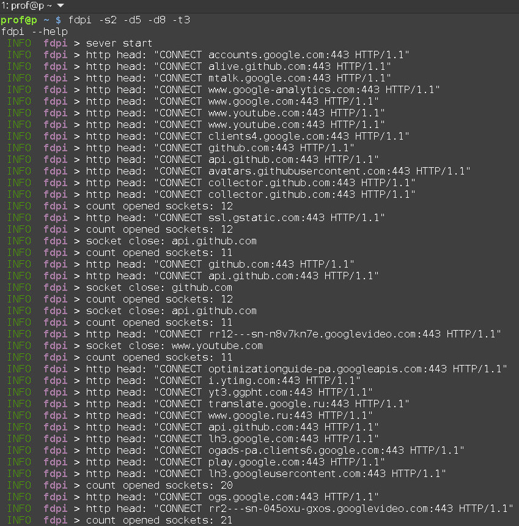

# fdpi
fuck dpi, http proxy

## install
```
git cone https://github.com/Cergoo/fdpi.git
cargo build --release
```

## run
for: 
youtube.com, 
rutracker.org,
index.minfin.com.ua/russian-invading/casualties
```
./fdpi -d2 -d4 -d7 -t(1-4 you need to choose depending on your provider)        
google-chrome --proxy-server="http://127.0.0.1:8080"

or -s2 -d5 -d8 -t3
```
see youtube

### ok, release, everything works for me.


